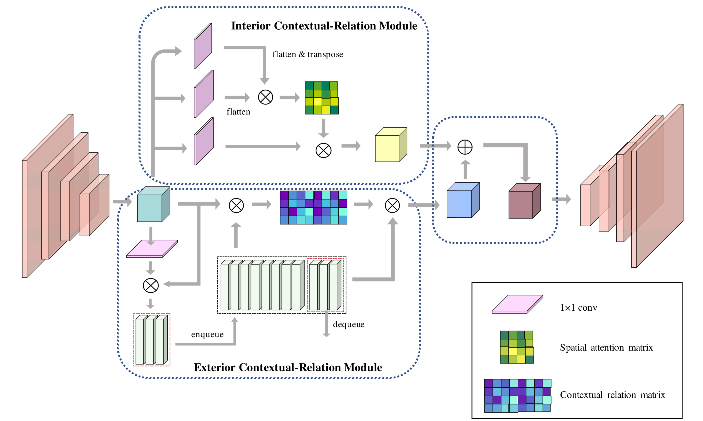
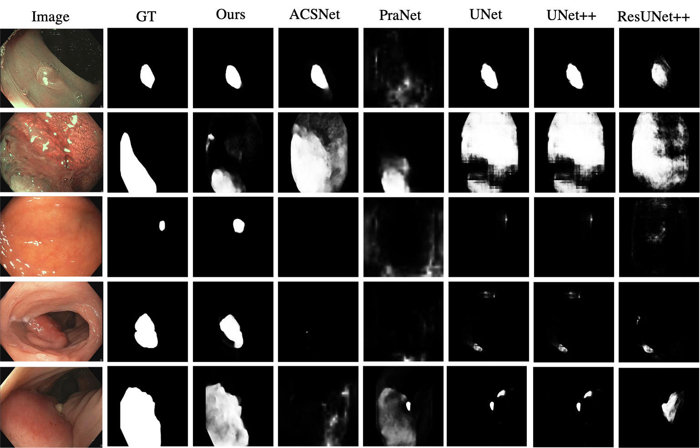
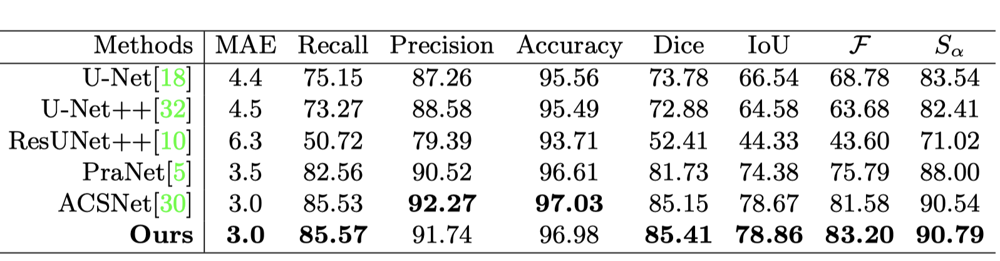
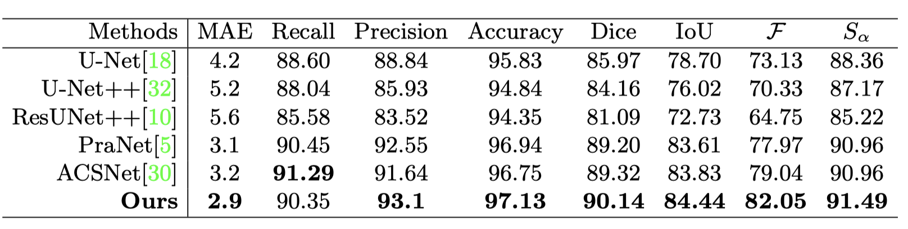
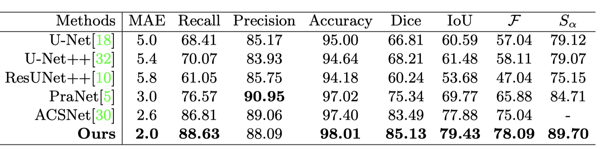

# Polyp Segmentation Model

## Introduction

The repository contains the PyTorch implementation of **"Duplex Contextual Relations for PolypSegmentation"**

## Overview

####  1. Framework

      
    <em> 
    Figure 1: Overview of our proposed DCRNet.
    </em>

####  2. Quantitative Results

      
    <em> 
    Figure 2: Qualitative results.
    </em>

####  3. Qualitative Results

      
    <em> 
    Figure 3: Quantitative results on EndoScene dataset.
    </em>

      
    <em> 
    Figure 4: Quantitative results on Kvasir-SEG dataset.
    </em>

      
    <em> 
    Figure 5: Quantitative results on PICCOLO dataset.
    </em>

## Usage

#### 1. Prerequisite environment

1. **torch>=1.5.0**
2. **torchvision>=0.6.0**

3. tqdm

4. scipy

5. scikit-image

6. PIL

7. numpy

8. CUDA

#### 2. Dataset downloading

- Downloading the CVC-EndoSceneStill dataset, which can be found in this [Google Drive link](https://drive.google.com/file/d/1MuO2SbGgOL_jdBu3ffSf92feBtj8pbnw/view?usp=sharing)
- Downloading the Kvasir-SEG dataset, which can be found in this [Google Drive link](https://drive.google.com/file/d/1S9aV_CkvJcsouRN4zvjtyL1vDhBkGRqA/view?usp=sharing)
- To access the PICCOLO dataset, please visit [here](https://www.biobancovasco.org/en/Sample-and-data-catalog/Databases/PD178-PICCOLO-EN.html)

#### 3. Train

- Assign your customized path of `--train_path ` ,`--save_root` and `--gpu` in `Train.py`.
- Run `python Train.py `

#### 4. Test

- Assign the `--pth_path ` ,  `--data_root` ,  `--save_root` and `--gpu` in `Test.py`.
- Run `python Test.py `
- The quantitative results will be displayed in your screen, and the qualitative results will be saved in your customized path.

#### 5. Evaluate

- The evaluation code is stored in ./utils/eval.py
- You can replace it with your customized evaluation metrics.